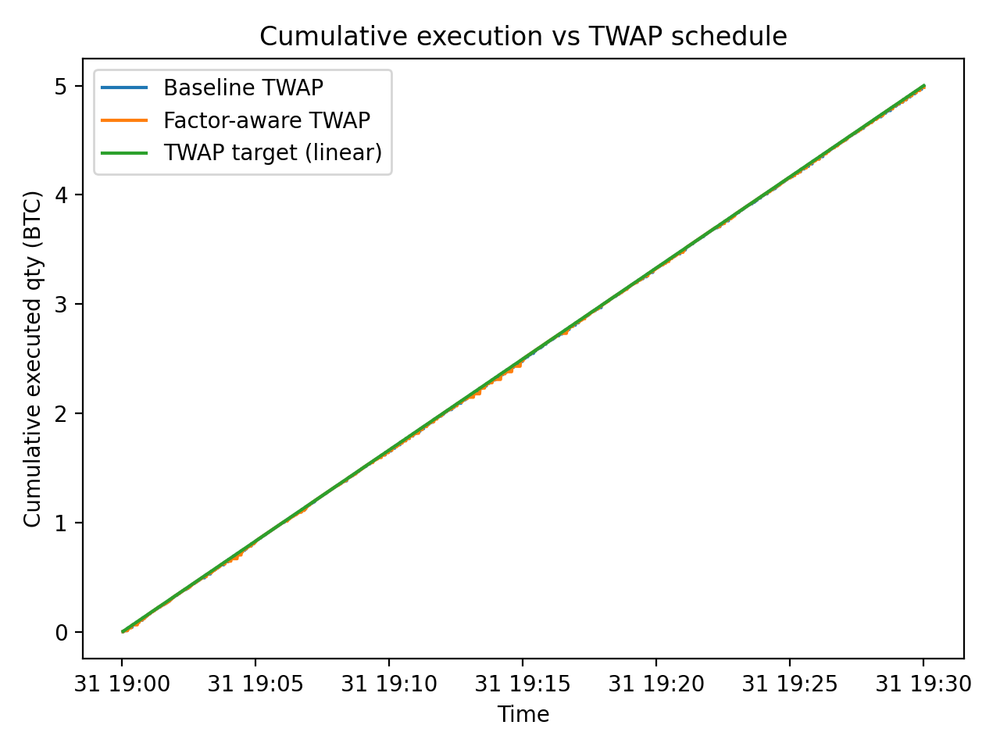
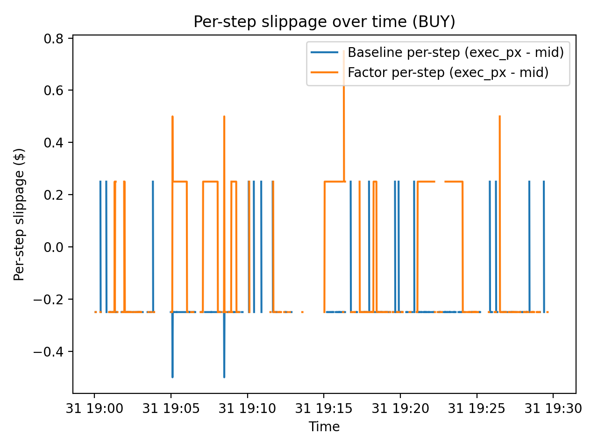

# Factor-Aware TWAP Execution for BTC

*A microstructure-driven execution timing study*

Author: Xuhui Liu

## 1. Project Overview

Large cryptocurrency trades face a fundamental trade-off between **market impact** and **execution risk**.
Time-weighted average price (TWAP) algorithms mitigate impact by spreading execution over time, but standard TWAP strategies are *time-blind*: they ignore short-term changes in liquidity, volatility, and order-flow conditions.

This project studies whether **execution timing can be improved** by augmenting a standard TWAP strategy with a **data-driven urgency factor** derived from high-frequency market microstructure signals.

Specifically, I:

* construct a set of second-level microstructure features from BTC perpetual futures data,
* extract a **latent execution urgency factor** using PCA,
* embed this factor into a **factor-aware TWAP execution simulator**, and
* compare its behavior against a baseline bounded TWAP under identical constraints.

The focus is **not alpha generation**, but **execution decision-making under uncertainty**, aligned with modern quantitative execution research.

---

## 2. Data

**Source:** Deribit BTC-PERPETUAL (via Tardis.dev downloadable CSVs)
**Date:** 2019-11-01
**Resolution:** 1-second aggregation
**Market:** Crypto perpetual futures (BTC-PERPETUAL)

### Raw Inputs

* Top-of-book quotes (best bid / ask + sizes)
* Trades (price, quantity, side)

### Preprocessing

* Quotes and trades are aggregated to a **1-second grid**
* Quotes define the time backbone
* Missing seconds are forward-filled using last observed state (standard in execution modeling)

---

## 3. Feature Engineering (Microstructure Signals)

From the 1-second data, I construct the following features:

| Feature          | Description                                   |
| ---------------- | --------------------------------------------- |
| `spread`         | Best ask − best bid                           |
| `mid`            | Mid-price                                     |
| `rv_60s`         | Realized volatility over trailing 60s         |
| `vol_60s`        | Traded volume over trailing 60s               |
| `ofi_60s`        | Order Flow Imbalance (signed volume)          |
| `book_imbalance` | (Bid size − Ask size) / (Bid size + Ask size) |

These features capture **liquidity, volatility, and order-flow pressure**, which are central drivers of short-term execution risk.

---

## 4. PCA-Based Execution Urgency Factor

To reduce dimensionality and extract a coherent execution signal, I apply **Principal Component Analysis (PCA)** to standardized microstructure features:

```text
Input features:
  spread, rv_60s, ofi_60s, vol_60s, book_imbalance
```

### Results

* **PC1 explains ~36% of total variance**
* Dominant loadings:

  * `vol_60s` (≈ 0.69)
  * `rv_60s` (≈ 0.69)
  * `spread` (≈ 0.18)

This component is interpreted as a **market activity / urgency factor**:

* high values → volatile, active market → higher execution risk from waiting
* low values → calmer market → patience is less costly

The factor direction is explicitly aligned so that **higher values imply higher urgency to cross the spread**.

---

## 5. Execution Simulator

### Execution Task

* **Side:** BUY
* **Quantity:** 5 BTC
* **Horizon:** 30 minutes (1800 seconds)
* **Schedule:** Linear TWAP

### Baseline Strategy — Bounded TWAP

* Attempts passive execution at best bid
* If behind schedule by more than a tolerance → crosses the spread
* Passive fills are **stochastic and partial**, with probability increasing in recent volume

### Factor-Aware Strategy — Urgency-Adaptive TWAP

* Same schedule and constraints as baseline
* Crossing tolerance dynamically adjusted using the PCA urgency factor:

  * High urgency → cross earlier
  * Low urgency → remain patient

Both strategies are evaluated on the **same market window**, with identical randomness for fair comparison.

---

## 6. Results

### Execution Behavior

| Metric                  | Baseline TWAP | Factor-Aware TWAP |
| ----------------------- | ------------- | ----------------- |
| Total quantity          | 5 BTC         | 5 BTC             |
| Aggressive cross events | 60            | **399**           |
| Passive fill events     | 793           | 502               |
| Passive no-fill events  | 948           | 900               |
| Final forced cross      | 1             | 1                 |

The factor-aware strategy **systematically front-loads execution** during periods of elevated urgency, while the baseline strategy delays execution and relies more heavily on late catch-up.

---


### Visual Diagnostics

#### 6.1 Cumulative Execution vs TWAP Schedule

<p align="center">
  
</p>

This figure compares cumulative executed quantity against the linear TWAP target for both strategies.

* Both baseline and factor-aware TWAP complete the full 5 BTC within the 30-minute horizon.
* Deviations from the target line reflect stochastic passive fills and aggressive catch-up trades.
* The factor-aware strategy slightly front-loads execution during periods of elevated urgency, while the baseline strategy remains more uniform.

---

#### 6.2 Urgency Factor with Aggressive-Cross Decisions

<p align="center">
  
</p>

This figure shows the standardized PCA-based urgency factor over time, overlaid with aggressive crossing decisions.

* **Orange dots:** aggressive crosses by the factor-aware TWAP
* **Blue crosses:** aggressive crosses by the baseline TWAP

Aggressive executions under the factor-aware strategy cluster strongly at high urgency values, validating the economic interpretation of the factor.

---

#### 6.3 Per-Step Slippage Over Time (BUY)

<p align="center">
  
</p>

This figure plots per-step execution slippage relative to mid-price:


* Negative slippage corresponds to successful passive fills.
* Positive spikes correspond to aggressive spread-crossing executions.
* The factor-aware strategy exhibits more frequent positive slippage spikes, reflecting a deliberate immediacy–cost trade-off.

---

## 7. Interpretation

This study demonstrates that:

* Market microstructure signals can be compressed into a **single interpretable urgency factor**
* Embedding this factor into TWAP **changes execution timing behavior in a controlled way**
* The resulting trade-off between **impact and execution risk** is explicit and measurable

Importantly, this framework does **not** claim universal cost reduction; rather, it provides a **principled mechanism for timing decisions**, which is central to real-world quantitative execution systems.

---

## 8. Limitations and Future Work

* No full L2 queue position modeling
* No permanent market impact modeling
* Single-day sample, single execution window
* No transaction fee modeling

Future extensions could include:

* queue-position-aware passive fills
* nonlinear factor models
* multi-day evaluation
* VWAP-style benchmarks

---


